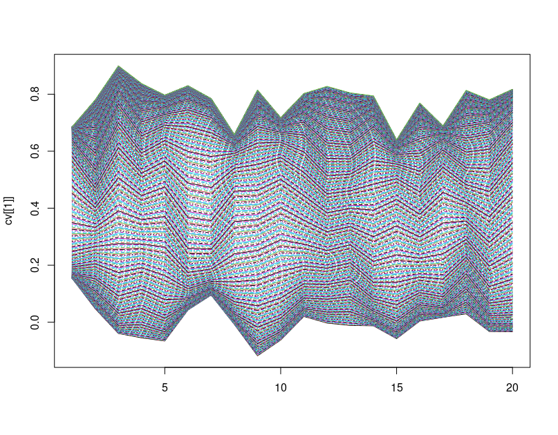

`r Sys.Date()`

```{r setup, include=FALSE}
knitr::opts_chunk$set(echo = FALSE, fig.align = 'center', 
                      message = FALSE, warning = FALSE,
                      fig.width = 12, fig.height = 6)
```


# New bootstrap method
Here, we:

1. Fit each of the simulated curves
2. For 1 in 1:B, sample from each group with replacement
3. From each sampled group, draw new parameters from fitted distribution
4. repeat

We start with 20 subjects in each group, the two groups being group A and B

```{r}
library(bdots)
library(eyetrackSim)
library(mvtnorm)
library(MASS)

## First, fit actual data that we have
load("~/packages/bdots/data/ci.rda")
ci <- as.data.table(ci)
ci <- ci[LookType == "Target", ]
res.l <- bdotsFit(data = ci,
                  subject = "Subject",
                  time = "Time",
                  y = "Fixations",
                  group = "protocol",
                  curveType = logistic(),
                  cor = TRUE,
                  numRefits = 2)


## Take subsets for new starting parameters
sub1 <- res.l[Subject == 2, ]$fit[[1]]
sub2 <- res.l[Subject == 38, ]$fit[[1]]

## Create new subjects based on this
createSets <- function(x, n = 20, time = seq(0, 2000, by = 4), group = "A") {
  set.seed(69)
  pars <- coef(x)
  vv <- vcov(x)
  vv <- 15*diag(nrow(vv)) %*% vv
  #vv <- 15*vv
  mm <- mvrnorm(n, mu = pars, Sigma = vv)
  mmF <- apply(mm, 1, function(x) {
    eyetrackSim:::logistic_f(x, time)
  })
  #matplot(mmF, type = 'l')
  dt <- data.table(sub = rep(1:n, each = length(time)),
                   time = time,
                   group = group,
                   fixation = as.numeric(mmF))
  return(list(pars = mm, fits = mmF, dt = dt))
}

dt1 <- createSets(sub1)
dt2 <- createSets(sub2, group = "B")
dt2$dt[, sub := sub + 20]
dt <- rbindlist(list(dt1$dt, dt2$dt))

## Fit new subjects
res <- bdotsFit(data = dt,
                y = "fixation",
                group = "group",
                subject = "sub",
                time = "time",
                curveType = logistic(),
                cores = 7)

## Create bootstrap function that
# 1. Resamples w replacement from each group
# 2. Gets mean and var matrix
# 3. Redraw new parameters
# 4. combine and fit curve
#' @param x A bdotsObj
bsFunction <- function(x) {
 xs <- split(x, by = "group")
 newpars <- lapply(xs, function(y) {
   idx <- sample(seq_len(nrow(y)), replace = TRUE)
   yn <- y[idx, ]
   yn$splitvar <- seq_len(nrow(y))
   yns <- split(yn, by = "splitvar")
   ypar <- vapply(yns, function(z) {
     rmvnorm(1, coef(z), vcov(z$fit[[1]]))
   }, numeric(4)) |> t()
   colMeans(ypar)
 })
}

bootstrapCurves <- function(x, n = 100) {
  tt <- replicate(n, bsFunction(x), simplify = FALSE)
  A <- sapply(tt, `[[`, 1) |> t()
  B <- sapply(tt, `[[`, 2) |> t()
  time <- attr(x, "time")
  ac <- apply(A, 1, function (x) {
    eyetrackSim:::logistic_f(x, time)
  })
  bc <- apply(B, 1, function (x) {
    eyetrackSim:::logistic_f(x, time)
  })
  parMat <- list("A" = A, "B" = B)
  curves <- list("A" = ac, "B" = bc)
  list(pars = parMat, curves = curves)
}

### Here, we begin showing what was fit
tt <- bootstrapCurves(res, 1000)
time <- attr(res, "time")

boot <- bdotsBoot(fixation ~ group(A,B), res)
```

Before we begin, here are the bootstrap means from bdots proper

```{r}
plot(boot, plotDiffs = FALSE)
```


## Group A

First, we compare the original curve against all B = 1000 bootstraps from the new method

```{r}
ac <- tt$curves$A
matplot(ac, type = 'l', main = "Group A, all bootstraps")
lines(eyetrackSim:::logistic_f(coef(sub1), time), lwd = 3, col = 'red')
```

We also plot the 95% CI using quantiles and standard deviation, showing the bootstrapped mean as well as the original curve

```{r, fig.width = 15, fig.height=10}
cm <- tt$curves$A
sdm <- apply(cm, 1, sd)
qm <- apply(cm, 1, function(x) quantile(x, probs = c(0.025, 0.975)))
mmat <- apply(cm, 1, mean)
tv <- qt(0.975, 20)

mm1 <- cbind(mmat - tv*sdm, mmat, mmat + tv*sdm)
mm2 <- cbind(qm[1, ], mmat, qm[2, ])

## Plotting SD and Quantile
par(mfrow = c(1, 2))
matplot(mm1, type = 'l', lty = c(2,1,2), col = c("blue", "black", "blue"), 
        main = "New bootstrap Group A -- SD", lwd = 2, ylab = "proportion")
lines(eyetrackSim:::logistic_f(coef(sub1), time), col = 'green', lwd = 2)
legend(x = 300, y = 0.4, legend = c("Mean Bootstrap", "Original"), 
       col = c("black", "green"), lty = 1, lwd = 2)
matplot(mm2, type = 'l', lty = c(2,1,2), col = c("blue", "black", "blue"), 
        main = "New bootstrap Group A -- Quantile", lwd = 2, ylab = "proportion")
lines(eyetrackSim:::logistic_f(coef(sub1), time), col = 'green', lwd = 2)
legend(x = 300, y = 0.4, legend = c("Mean Bootstrap", "Original"), 
       col = c("black", "green"), lty = 1, lwd = 2)
```

We then compare SD and quantile between bdots and new method. I don't include the original curve, though its obviously situated between the two bands. Note that for the quantile, they are nearly on top of each other for original bdots

```{r, fig.width = 15, fig.height=10}
cmboot <- boot$curveList$A$curveMat

sdmboot <- apply(cmboot, 2, sd)
qmboot <- apply(cmboot, 2, function(x) quantile(x, probs = c(0.025, 0.975)))
mmatboot <- apply(cmboot, 2, mean)
tv <- qt(0.975, 28)
mm1boot <- cbind(mmatboot - tv*sdmboot, mmatboot, mmatboot + tv*sdm)
mm2boot <- cbind(qmboot[1, ], mmatboot, qmboot[2, ])

## Comparing these with previous (SD)
par(mfrow = c(1, 2))
matplot(cbind(mm1boot[, c(1,3)], mm1[, c(1,3)]), type = 'l', lty = c(2, 2, 3, 3), ylab = "proportion", 
        col = c("red", "red", "blue", "blue"), lwd = 2, main = "Comparing SD between bdots and new bootstrap")
lines(eyetrackSim:::logistic_f(coef(sub1), time), col = 'green', lwd = 2)
legend(x = 300, y = 0.2, legend = c("bdots SD bands", "New SD bands", 
                                    "True Curve"), 
       lwd = 2, col = c("red", "blue", "green"), lty = c(2,3,1))

# matplot(cbind(mm1boot[, 2], mm1[, 2]), type = 'l', lty = 1, lwd = 2, ylab = "proportion", 
#         col = c("red", "black"), main = "Comparing mean curves")
# lines(eyetrackSim:::logistic_f(coef(sub1), time), col = 'green', lwd = 2)
# legend(x = 300, y = 0.2, legend = c("bdots mean curve", "New mean curve", "True Curve"), 
#        lwd = 2, col = c("red", "black", "green"), lty = 1)

## Now with quantiles
## Comparing these with previous (quantile)
#par(mfrow = c(1, 2))
matplot(cbind(mm2boot[, c(1,3)], mm2[, c(1,3)]), type = 'l', lty = c(2, 2, 3, 3), ylab = "proportion", 
        col = c("red", "red", "blue", "blue"), lwd = 2, main = "Comparing Quantile between bdots and new bootstrap")
lines(eyetrackSim:::logistic_f(coef(sub1), time), col = 'green', lwd = 2)
legend(x = 200, y = 0.2, legend = c("bdots Quantile bands", "New Quantile bands", 
                                    "True Curve"), 
       lwd = 2, col = c("red", "blue", "green"), lty = c(2,2,1))

# matplot(cbind(mm2boot[, 2], mm2[, 2]), type = 'l', lty = 1, lwd = 2, ylab = "proportion", 
#         col = c("red", "black"), main = "Comparing mean curves")
# lines(eyetrackSim:::logistic_f(coef(sub1), time), col = 'green', lwd = 2)
# legend(x = 300, y = 0.2, legend = c("bdots mean curve", "New mean curve", "True Curve"), 
#        lwd = 2, col = c("red", "black", "green"), lty = 1)

```

For completeness, we show the mean bootstrapped curves compared with the original. As perhaps expected, the mean bootstraps are both nearly identical

```{r}
matplot(cbind(mm1boot[, 2], mm1[, 2]), type = 'l', lty = 1, lwd = 2, ylab = "proportion",
        col = c("red", "black"), main = "Comparing mean curves")
lines(eyetrackSim:::logistic_f(coef(sub1), time), col = 'green', lwd = 2)
legend(x = 300, y = 0.2, legend = c("bdots mean curve", "New mean curve", "True Curve"),
       lwd = 2, col = c("red", "black", "green"), lty = 1)
```


We'll repeat the same thing with group B

## Group B

First, collection of bootstraps from new method

```{r}
ac <- tt$curves$B
matplot(ac, type = 'l', main = "Group B, all bootstraps new method")
lines(eyetrackSim:::logistic_f(coef(sub2), time), lwd = 3, col = 'red')
```

Then SD and quantile of the new method

```{r, fig.width = 15, fig.height=10}
## Show B with SD
cm <- tt$curves$B
sdm <- apply(cm, 1, sd)
qm <- apply(cm, 1, function(x) quantile(x, probs = c(0.025, 0.975)))
mmat <- apply(cm, 1, mean)
tv <- qt(0.975, 20)

mm1 <- cbind(mmat - tv*sdm, mmat, mmat + tv*sdm)
mm2 <- cbind(qm[1, ], mmat, qm[2, ])

## Plotting SD and Quantile
par(mfrow = c(1, 2))
matplot(mm1, type = 'l', lty = c(2,1,2), col = c("blue", "black", "blue"), 
        main = "New bootstrap Group B -- SD", lwd = 2, ylab = "proportion")
lines(eyetrackSim:::logistic_f(coef(sub2), time), col = 'green', lwd = 2)
legend(x = 300, y = 0.4, legend = c("Mean Bootstrap", "Original"), 
       col = c("black", "green"), lty = 1, lwd = 2)
matplot(mm2, type = 'l', lty = c(2,1,2), col = c("blue", "black", "blue"), 
        main = "New bootstrap Group B -- Quantile", lwd = 2, ylab = "proportion")
lines(eyetrackSim:::logistic_f(coef(sub2), time), col = 'green', lwd = 2)
legend(x = 300, y = 0.4, legend = c("Mean Bootstrap", "Original"), 
       col = c("black", "green"), lty = 1, lwd = 2)
```

Finally, a comparison between bdots and new

```{r, fig.width = 15, fig.height=10}
cmboot <- boot$curveList$B$curveMat

sdmboot <- apply(cmboot, 2, sd)
qmboot <- apply(cmboot, 2, function(x) quantile(x, probs = c(0.025, 0.975)))
mmatboot <- apply(cmboot, 2, mean)
tv <- qt(0.975, 28)
mm1boot <- cbind(mmatboot - tv*sdmboot, mmatboot, mmatboot + tv*sdm)
mm2boot <- cbind(qmboot[1, ], mmatboot, qmboot[2, ])

## Comparing these with previous (SD)
par(mfrow = c(1, 2))
matplot(cbind(mm1boot[, c(1,3)], mm1[, c(1,3)]), type = 'l', lty = c(2, 2, 2, 2), ylab = "proportion", 
        col = c("red", "red", "blue", "blue"), lwd = 2, main = "Comparing SD between bdots and new bootstrap")
lines(eyetrackSim:::logistic_f(coef(sub2), time), col = 'green', lwd = 2)
legend(x = 300, y = 0.2, legend = c("bdots SD bands", "New SD bands", 
                                    "True Curve"), 
       lwd = 2, col = c("red", "blue", "green"), lty = c(2,2,1))

## Now with quantiles
## Comparing these with previous (quantile)
matplot(cbind(mm2boot[, c(1,3)], mm2[, c(1,3)]), type = 'l', lty = c(2, 2, 2, 2), ylab = "proportion", 
        col = c("red", "red", "blue", "blue"), lwd = 2, main = "Comparing Quantile between bdots and new bootstrap")
lines(eyetrackSim:::logistic_f(coef(sub2), time), col = 'green', lwd = 2)
legend(x = 200, y = 0.2, legend = c("bdots Quantile bands", "New Quantile bands", 
                                    "True Curve"), 
       lwd = 2, col = c("red", "blue", "green"), lty = c(2,2,1))
```

And mean curves to round it off

```{r}
matplot(cbind(mm2boot[, 2], mm2[, 2]), type = 'l', lty = 1, lwd = 2, ylab = "proportion",
        col = c("red", "black"), main = "Comparing mean curves")
lines(eyetrackSim:::logistic_f(coef(sub2), time), col = 'green', lwd = 2)
legend(x = 300, y = 0.2, legend = c("bdots mean curve", "New mean curve", "True Curve"),
       lwd = 2, col = c("red", "black", "green"), lty = 1)
```

# Round 2

We are going to do the same thing again, but with 100 subjects in each group (hoping to better recover true mean curve), still 1000 bootstraps. We will limit plots to simply looking at the derived quantile and sd bands. No need to look at bdots as we are interested in performance of new method

```{r}
dt1 <- createSets(sub1, n = 100)
dt2 <- createSets(sub2, group = "B", n = 100)
dt2$dt[, sub := sub + 20]
dt <- rbindlist(list(dt1$dt, dt2$dt))

## Fit new subjects
res <- bdotsFit(data = dt,
                y = "fixation",
                group = "group",
                subject = "sub",
                time = "time",
                curveType = logistic(),
                cores = 7)

tt <- bootstrapCurves(res, 1000)
time <- attr(res, "time")

#boot <- bdotsBoot(fixation ~ group(A,B), res)
```

## Group A

Quantile and SD bands

```{r, fig.width = 15, fig.height=10}
cm <- tt$curves$A
sdm <- apply(cm, 1, sd)
qm <- apply(cm, 1, function(x) quantile(x, probs = c(0.025, 0.975)))
mmat <- apply(cm, 1, mean)
tv <- qt(0.975, 20)

mm1 <- cbind(mmat - tv*sdm, mmat, mmat + tv*sdm)
mm2 <- cbind(qm[1, ], mmat, qm[2, ])

## Plotting SD and Quantile
par(mfrow = c(1, 2))
matplot(mm1, type = 'l', lty = c(2,1,2), col = c("blue", "black", "blue"), 
        main = "New bootstrap Group A -- SD", lwd = 2, ylab = "proportion")
lines(eyetrackSim:::logistic_f(coef(sub1), time), col = 'green', lwd = 2)
legend(x = 300, y = 0.4, legend = c("Mean Bootstrap", "Original"), 
       col = c("black", "green"), lty = 1, lwd = 2)
matplot(mm2, type = 'l', lty = c(2,1,2), col = c("blue", "black", "blue"), 
        main = "New bootstrap Group A -- Quantile", lwd = 2, ylab = "proportion")
lines(eyetrackSim:::logistic_f(coef(sub1), time), col = 'green', lwd = 2)
legend(x = 300, y = 0.4, legend = c("Mean Bootstrap", "Original"), 
       col = c("black", "green"), lty = 1, lwd = 2)
```

## Group B

```{r, fig.width = 15, fig.height=10}
cm <- tt$curves$B
sdm <- apply(cm, 1, sd)
qm <- apply(cm, 1, function(x) quantile(x, probs = c(0.025, 0.975)))
mmat <- apply(cm, 1, mean)
tv <- qt(0.975, 20)

mm1 <- cbind(mmat - tv*sdm, mmat, mmat + tv*sdm)
mm2 <- cbind(qm[1, ], mmat, qm[2, ])

## Plotting SD and Quantile
par(mfrow = c(1, 2))
matplot(mm1, type = 'l', lty = c(2,1,2), col = c("blue", "black", "blue"), 
        main = "New bootstrap Group B -- SD", lwd = 2, ylab = "proportion")
lines(eyetrackSim:::logistic_f(coef(sub2), time), col = 'green', lwd = 2)
legend(x = 300, y = 0.4, legend = c("Mean Bootstrap", "Original"), 
       col = c("black", "green"), lty = 1, lwd = 2)
matplot(mm2, type = 'l', lty = c(2,1,2), col = c("blue", "black", "blue"), 
        main = "New bootstrap Group B -- Quantile", lwd = 2, ylab = "proportion")
lines(eyetrackSim:::logistic_f(coef(sub2), time), col = 'green', lwd = 2)
legend(x = 300, y = 0.4, legend = c("Mean Bootstrap", "Original"), 
       col = c("black", "green"), lty = 1, lwd = 2)
```

# Curious about convergence

Nevermind the bootstrapped bits. If I have enough subjects, will my mean fitted curve asymptotically approach the generating curve? Let's try with N = 1000 subjects

```{r}

dt1 <- createSets(sub1, n = 1000)
dt2 <- createSets(sub2, group = "B", n = 1000)
dt2$dt[, sub := sub + 20]
dt <- rbindlist(list(dt1$dt, dt2$dt))

## Fit new subjects
res <- bdotsFit(data = dt,
                y = "fixation",
                group = "group",
                subject = "sub",
                time = "time",
                curveType = logistic(),
                cores = 7)


sp <- split(res, by = "group")
pl <- lapply(sp, coef)

time <- seq(0, 2000, by = 4)
cv <- lapply(pl, function(x) {
  mmF <- apply(x, 1, function(y) {
    eyetrackSim:::logistic_f(y, time)
  })
})

par(mfrow = c(1, 2))
plot(eyetrackSim:::logistic_f(coef(sub1), time), col = 'black', lwd = 3, 
     type = 'l', ylab = "proportion", main = "Group A, N = 1000")
lines(eyetrackSim:::logistic_f(colMeans(pl[[1]]), time), col = 'red', lwd = 3)
legend(x = 300, y = 0.2, col = c("black", "red"), legend = c("Original", "Fitted"), 
       lwd = 3)
plot(eyetrackSim:::logistic_f(coef(sub2), time), col = 'black', lwd = 3, 
     type = 'l', ylab = "proportion", main = "Group B, N = 1000")
lines(eyetrackSim:::logistic_f(colMeans(pl[[2]]), time), col = 'red', lwd = 3)
legend(x = 300, y = 0.2, col = c("black", "red"), legend = c("Original", "Fitted"), 
       lwd = 3)

```

# Takeaways

1. It seems that new method has better coverage than old (compute coverage as percentage of domain?)
2. Still having issues with lower bound of curve in index 100-300 range (same as before)
3. Increasing subjects seems to narrow the bands but not necessarily improve convergence to true curve. Peculiar

# Bonus

I accidentally plotted the tranpose of a matrix and it ended up being pretty neat


