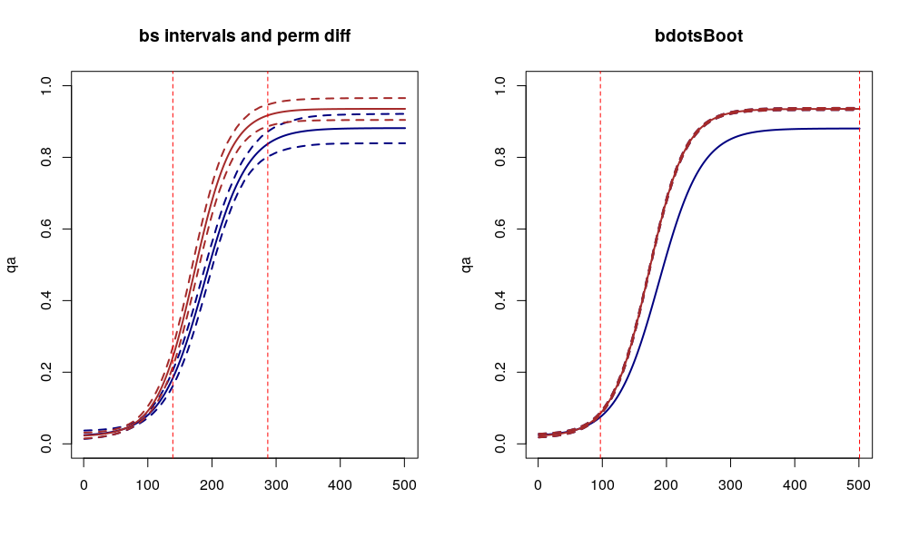

`r Sys.Date()`

```{r setup, include=FALSE}
knitr::opts_chunk$set(echo = FALSE, fig.align = 'center')
```

# Permutation

Ok, so our first stab with generating confidence intervals both ways AND comparing against permutation.

Might still be worth testing how the bdots $\alpha$ adjustment looks once we've fixed these intervals. I'm going to plan on making adjustments to the package next week



# Step function

Here we have a step function with noise and ran it through bdots without any adjustments. The first group is everywhere zero, the second has values of 0.5 and 1 on the intervals (20, 35) and (60, 75). Because there is random noise, I went ahead and did this a few times to see what shakes. For reference there are

- 25 subjects in each group
- Noise is the mean of a hundred "trials" with binomial noise, $p = 0.05$

### Round 1

```{r}

library(MASS)
library(mvtnorm)
suppressPackageStartupMessages(library(bdots))

#' @param p height of step
s1 <- function(p) {
  stopifnot(length(p) == 3)
  x <- c(20, 60) # putting here for now
  x1 <- x[1]
  x2 <- x[2]
  x3 <- p[3]
  y <- vector("numeric", length = 100L)
  y[`:`(x1, x1+15)] <- p[1]
  y[`:`(x2, x2+15)] <- p[2]
  y[c(1:19, 36:59, 76:100)] <- x3
  y
}

# drawing parameters for group 1
p <- rmvnorm(100, mean = c(1,2), sigma = diag(2)*0.25)

# no need for trials
createStepData <- function(n = 25, trials = 100, pars, gp = "A") {
  p <- rmvnorm(n, mean = pars, sigma = diag(length(pars))*0.05)
  p <- abs(p)
  spars <- split(p, row(p))
  dts <- lapply(seq_len(n), function(x) {
    pp <- spars[[x]]
    dt <- data.table(id = x, 
                     time = 1:100, 
                     group = gp, 
                     true = s1(pp))
    dt[, fixations := mean(rbinom(trials, 1, 0.1)) + true, by = time]
    dt[, fixations := abs(fixations)]
  })
  dts <- rbindlist(dts)
  return(dts) # don't need pars here
}

dt1 <- createStepData(n = 25, pars = c(0.5,1,0), gp = "A")
dt2 <- createStepData(n = 25, pars = c(0,0,0), gp = "B")
dt2[, id := id + 25]
dt <- rbindlist(list(dt1, dt2))

#dt <- split(dt,by = "id")

#dat <- dt[[1]]

## Cool, this for bdots
stepPars <- function(dat, y, time, params = NULL, ...) {
  #time <- dat[[time]]
  y2 <- dat[[y]]
  
  p1 <- max(y2[20:30])
  p2 <- max(y2[60:70])
  p3 <- max(min(y2), 0)
  params <- c(p1, p2, p3)
  names(params) <- c("p1", "p2", "p3")
  y <- str2lang(y)
  time <- str2lang(time)
  ff <- bquote(.(y) ~ (.(time) >= 20 & .(time) <=35)*p1 +
                 (.(time) >= 60 & .(time) <= 75)*p2 + p3)
  attr(ff, "parnames") <- names(params)
  return(list(formula = ff, params = params))
}

fit <- bdotsFit(data = dt, 
                subject = "id",
                time = "time", 
                group = "group",
                y = "fixations", 
                curveType = stepPars())
# debugonce(bdotsFit)


boot <- bdotsBoot(fixations ~ group(A, B), fit)

## Well, shit
plot(boot, plotDiffs = FALSE)

```

```{r}

getT_step <- function(x, idx, whole = FALSE) {
  x$group <- x$group[idx]
  fit_s <- split(x, by = "group")
  mvl <- lapply(fit_s, function(y) {
    cc <- coef(y)
    time <- seq(0, 100, by = 1)
    cl <- apply(cc, 1, function(kk) {s1(kk)})
    mm <- rowMeans(cl)
    vv <- apply(cl, 1, var)
    vvn <- vv/nrow(cc)
    list(mean = mm, nvar = vvn)
  })
  
  ## Guess I don't need a function for this
  x <- mvl[[1]]; y <- mvl[[2]]
  xm <- x$mean; xv <- x$nvar
  ym <- y$mean; yv <- y$nvar
  Tt <- abs(xm-ym) / sqrt(yv + xv)
  
  ifelse(whole, return(Tt), return(max(Tt)))
}

getTDist_step <- function(x, P = 500) {
  n <- nrow(x)
  permmat <- replicate(P, sample(seq_len(n), n))
  tvec <- getT_step(x, seq_len(n), whole = TRUE)
  tnull <- apply(permmat, 2, function(y) {
    getT_step(x, y)
  })
  tnull
}

t500 <- getTDist_step(fit, P = 500)
actual_t <- getT_step(fit, seq_len(nrow(fit)), whole = TRUE)
tq <- quantile(t500, probs = 0.975)

plot(actual_t, type = 'l')
abline(h = tq, lty = 2, col = 'red')

time <- 1:100
idx <- which(actual_t > tq)
sig_time <- time[idx]

lq <- which(diff(idx) != 1)

abline(v = min(idx), col = 'red', lty = 2) # use idx bc curves on idx scale not time
abline(v = max(idx), col = 'red', lty = 2)

if (length(lq) == 1) {
  abline(v = idx[lq], col = 'red', lty = 2)
  abline(v = idx[lq+1], col = 'red', lty = 2)
}
```

### Round 2

```{r}
dt1 <- createStepData(n = 25, pars = c(0.5,1,0), gp = "A")
dt2 <- createStepData(n = 25, pars = c(0,0,0), gp = "B")
dt2[, id := id + 25]
dt <- rbindlist(list(dt1, dt2))

fit <- bdotsFit(data = dt, 
                subject = "id",
                time = "time", 
                group = "group",
                y = "fixations", 
                curveType = stepPars())
# debugonce(bdotsFit)


boot <- bdotsBoot(fixations ~ group(A, B), fit)

## Well, shit
plot(boot, plotDiffs = FALSE)


t500 <- getTDist_step(fit, P = 500)
actual_t <- getT_step(fit, seq_len(nrow(fit)), whole = TRUE)
tq <- quantile(t500, probs = 0.975)

plot(actual_t, type = 'l')
abline(h = tq, lty = 2, col = 'red')

time <- 1:100
idx <- which(actual_t > tq)
sig_time <- time[idx]

lq <- which(diff(idx) != 1)

abline(v = min(idx), col = 'red', lty = 2) # use idx bc curves on idx scale not time
abline(v = max(idx), col = 'red', lty = 2)

if (length(lq) == 1) {
  abline(v = idx[lq], col = 'red', lty = 2)
  abline(v = idx[lq+1], col = 'red', lty = 2)
}
```

### Round 3

```{r}
dt1 <- createStepData(n = 25, pars = c(0.5,1,0), gp = "A")
dt2 <- createStepData(n = 25, pars = c(0,0,0), gp = "B")
dt2[, id := id + 25]
dt <- rbindlist(list(dt1, dt2))

fit <- bdotsFit(data = dt, 
                subject = "id",
                time = "time", 
                group = "group",
                y = "fixations", 
                curveType = stepPars())
# debugonce(bdotsFit)


boot <- bdotsBoot(fixations ~ group(A, B), fit)

## Well, shit
plot(boot, plotDiffs = FALSE)


t500 <- getTDist_step(fit, P = 500)
actual_t <- getT_step(fit, seq_len(nrow(fit)), whole = TRUE)
tq <- quantile(t500, probs = 0.975)

plot(actual_t, type = 'l')
abline(h = tq, lty = 2, col = 'red')

time <- 1:100
idx <- which(actual_t > tq)
sig_time <- time[idx]

lq <- which(diff(idx) != 1)

abline(v = min(idx), col = 'red', lty = 2) # use idx bc curves on idx scale not time
abline(v = max(idx), col = 'red', lty = 2)

if (length(lq) == 1) {
  abline(v = idx[lq], col = 'red', lty = 2)
  abline(v = idx[lq+1], col = 'red', lty = 2)
}
```

### Round 4

```{r}
dt1 <- createStepData(n = 25, pars = c(0.5,1,0), gp = "A")
dt2 <- createStepData(n = 25, pars = c(0,0,0), gp = "B")
dt2[, id := id + 25]
dt <- rbindlist(list(dt1, dt2))

fit <- bdotsFit(data = dt, 
                subject = "id",
                time = "time", 
                group = "group",
                y = "fixations", 
                curveType = stepPars())
# debugonce(bdotsFit)


boot <- bdotsBoot(fixations ~ group(A, B), fit)

## Well, shit
plot(boot, plotDiffs = FALSE)


t500 <- getTDist_step(fit, P = 500)
actual_t <- getT_step(fit, seq_len(nrow(fit)), whole = TRUE)
tq <- quantile(t500, probs = 0.975)

plot(actual_t, type = 'l')
abline(h = tq, lty = 2, col = 'red')

time <- 1:100
idx <- which(actual_t > tq)
sig_time <- time[idx]

lq <- which(diff(idx) != 1)

abline(v = min(idx), col = 'red', lty = 2) # use idx bc curves on idx scale not time
abline(v = max(idx), col = 'red', lty = 2)

if (length(lq) == 1) {
  abline(v = idx[lq], col = 'red', lty = 2)
  abline(v = idx[lq+1], col = 'red', lty = 2)
}
```


### Round 5

```{r}
dt1 <- createStepData(n = 25, pars = c(0.5,1,0), gp = "A")
dt2 <- createStepData(n = 25, pars = c(0,0,0), gp = "B")
dt2[, id := id + 25]
dt <- rbindlist(list(dt1, dt2))

fit <- bdotsFit(data = dt, 
                subject = "id",
                time = "time", 
                group = "group",
                y = "fixations", 
                curveType = stepPars())
# debugonce(bdotsFit)


boot <- bdotsBoot(fixations ~ group(A, B), fit)

## Well, shit
plot(boot, plotDiffs = FALSE)


t500 <- getTDist_step(fit, P = 500)
actual_t <- getT_step(fit, seq_len(nrow(fit)), whole = TRUE)
tq <- quantile(t500, probs = 0.975)

plot(actual_t, type = 'l')
abline(h = tq, lty = 2, col = 'red')

time <- 1:100
idx <- which(actual_t > tq)
sig_time <- time[idx]

lq <- which(diff(idx) != 1)

abline(v = min(idx), col = 'red', lty = 2) # use idx bc curves on idx scale not time
abline(v = max(idx), col = 'red', lty = 2)

if (length(lq) == 1) {
  abline(v = idx[lq], col = 'red', lty = 2)
  abline(v = idx[lq+1], col = 'red', lty = 2)
}
```
